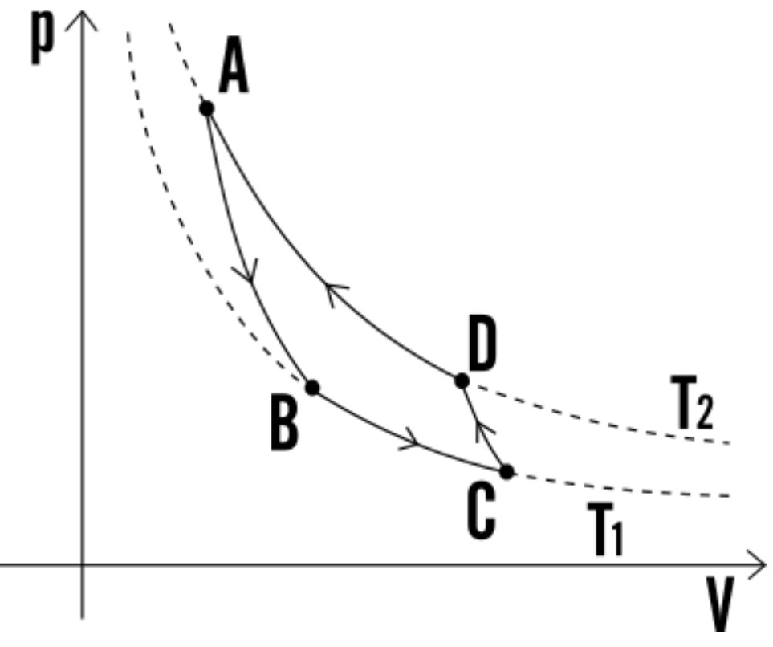

Lo studio dello scambio termico è studiato in fisica tecnica. Conoscenze preliminari per capire come funziona un processo di scambio termico (e in particolare il ciclo frigorifero basato sul [**ciclo inverso di Carnot**](https://www.youmath.it/lezioni/fisica/termodinamica/3627-ciclo-frigorifero-e-macchina-frigorifera.htm))

Concetti chiave:
- il **calore**, che è una forma di energia, convenzionalmente viene trasferito dai corpi a temperatura più calda a quelli a temperatura più fredda (non il contrario, che vorrebbe dire _calore negativo_);
- lo **stato** di un materiale (solido/liquido/aeriforme) è strettamente correlato all'**energia interna** del corpo. In generale un corpo solido _contiene_ più energia rispetto ad un liquido che a sua volta contiene più energia di un gas.

# Ciclo inverso di Carnot
Lo scopo fondamentale del ciclo inverso di Carnot impiegato nelle macchine frigorifere è sostanzialmente quello di rimuovere una certa quantità di calore $Q_s$ da un'ambiente a temperatura $T_s$ che è di per se più bassa della temperatura esterna $T_i$ (processo che non è naturalmente spontaneo). Per fare questo è necessario introdurre del lavoro netto meccanico $L$. L'efficacia di questo processo è descritta dal **coefficiente di prestazione** della macchina frigorifera descritto come
$$COP_f =\frac{Q_s}L$$

Per effettuare tale processo, il ciclo inverso di Carnot prevede fondamentalmente 4 trasformazioni di fase (dove ogni fase è caratterizzata, per quel che ci riguarda, da una temperatura $T$ e una pressione $p$) che sono associate a particolari componenti:
- trasformazione $1\rightarrow2$: **evaporatore**. Un liquido a pressione $p_1$ viene fatto **espandere isotermicamente** ad una temperatura $T_i$ fino ad un valore di pressione $p_2$. In questa fase si suppone che la temperatura del fluido $T_i$ sia inferiore alla temperatura della cella $T_{cella}$: in questo modo il calore viene trasferito dalla cella (che quindi si raffredda) al fluido volvente (che acquisisce nuova energia). L'energia aggiunta al liquido non viene utilizzata per innalzare la sua temperatura (in quanto si assume che sia in uno _stato saturo_), ma viene utilizzata per effettuare il passaggio di stato da liquido a vapore;
- trasformazione $2\rightarrow3$: **compressore**. Attraverso un compressore che richiede l'immissione di **lavoro** meccanico, il fluido volvente allo stato gassoso viene _compresso isoentropicamente_ dalla pressione $p_2$ alla pressione $p_3$. Come diretta consequenza di questa compressione la temperatura del fluido passera da $T_i$ a $T_s$;
- trasformazione $3\rightarrow4$: **condensatore**. A seguito della compressione si suppone che la temperatura $T_s$ del fluido sia superiore alla temperatura ambientale $T_{amb}$: questo permette infatti la cessione di una quantità di calore $Q_s$ dal fluido fluido allo stato gassoso verso l'ambiente. Questa operazione viene effettuata isotermicamente e la riduzione di energia interna del fluido lo trasforma dallo stato gassoso allo stato liquido;
- trasformazione $4\rightarrow1$: **turbina**. Dopo che il fluido è stato condensato si effettua un'_espansione isoentropica_ che mira a ridurre la temperatura del fluido da quella di condensazione $T_s$ a quella di evaporazione $T_i$ (di fatto facendo ripartire il ciclo).

Questo diagramma rappresenta le varie trasformazioni di stato nel diagramma $p-V$ (pressione volume); la corrispondenza tra lettera e stato è 1-B, 2-C, 3-D, 4-A. Inoltre $T_i = T_1$ e $T_s = T_2$.

# La struttura dell'impianto
Al lato pratico l'impianto di raffreddamento delle celle di Melinda è composto da due parti principali:
1. la parte dove viene di fatto _generato il freddo_ mediante una macchina frigorifera funzionante secondo il ciclo inverso di carnot. Nel caso in questione il fluido refrigerante utilizzato è l'**ammoniaca**
1. la parte del circuito che viene utilizzata per la distribuzione del freddo verso le celle frigorifere dislocate all'interno della struttura. In questo caso il fluido volvente è il **glicole**.

I due impianti _comunicano_ mediante uno scambiatore di calore. Nella fattispecie il la parte di scambiatore collegata alla macchina frigorifera funge da **condensatore** per l'ammoniaca: questo permette di raffreddare il glicole che verrà immagazzinato in un serbatoio che è collegato poi all'impianto di distribuzione.

Il calore viene estratto dalle celle semplicemente per conduzione termica sfruttando la differenza di temperatura $T_{glicole} - T_{cella}$.

## Su cosa dobbiamo lavorare noi
Quello che dovremmo fare è capire qual'è la massima temperatura del glicole che permettere di ottenere un corretto raffreddamento delle celle (dato il numero di celle attive, temperature ambientali esterne...). Conoscendo così tale temperatura è possibile ridurre il costo di raffreddamento (diminuendo la potenza richiesta dai compressori per ridurre la temperatura).

Il secondo fronte di miglioramento è quello di migliorare l'efficienza delle pompe a pressione calcolando opportuni setpoint in funzione della temperatura esterna e della richiesta di glicole nell'impianto.

