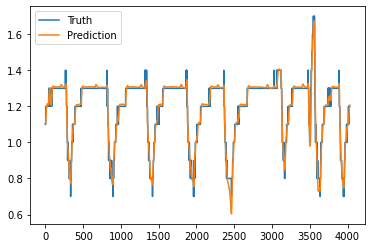
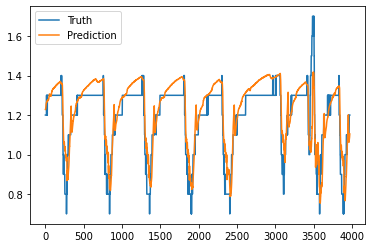
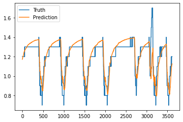
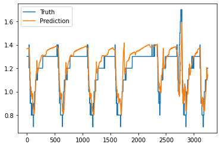
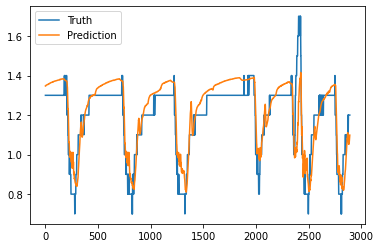
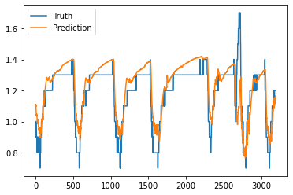
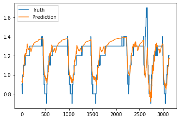

## THE NETWORK'S ARCHITECTURE

This Neural Network is implemented following the encoder-decoder architecture. The network is made of two 
distinct components: an "encoder" subnetwork, and a "decoder" subnetwork.

The encoder is a single LSTM layer, and its purpose is to compute a "state" vector, which represents the system's
(the refrigerating cell) current state, or context. Such context is an encoding of the past trend of the system. The layer takes as input the whole set of selected features, in a window that extends from the present moment up to *LOOKBACK_HOURS* hours before, with a resolution of 1 minute, where *LOOKBACK_HOURS* is an hyperparameter of the model.

The decoder has three hidden layers, an LSTM layer and two linear layers, with a final linear output layer. The decoder computes a prediction for the refrigerating cell's inner temperature in *FORECAST_LAG* minutes, where *FORECAST_LAG* could be 1 minute, 1 hours, 2 hours, and so on. The subnetwork receives as input the "state" vector produced by the encoder, together with the temperatures of the refrigerating liquid in the following hour. 

The basic idea that motivates using this network architecture is that the cell's inner temperature in one hour from now
should depend on the cell's current state ( wether the cell's temperature has been rising, or it has been constant for a while, ecc... ), and on the future values of the refregerating liquid's temperature.

The following is a list of experiments performed by training an encoder-decoder model on Cell13.

## EXPERIMENT 1

Features that were considered:
- TemperaturaCelle
- PompaGlicoleMarcia
- TemperaturaRitornoGlicole
- PercentualeAperturaValvolaMiscelatrice
- TemperaturaMandataGlicole

Neural Network Architecture:
- Encoder layers: 1 LSTM layer with 16 units
- Decode layers: 1 LSTM layers with 16 units, 2 linear layers with 16 units, one output layer

Hyperparameters:
- 0.7, 0.2, 0.1 train, validation, test split
- [0, 1] normalization
- *LOOKBACK_HOURS* = 6 hours
- *FORECAST_LAG* = 1 minutes
- 25 epochs
- Adam optimizer
- 512 items per batch

Results:
- mse test loss: 0.00027

## EXPERIMENT 2

Features that were considered:
- TemperaturaCelle
- PompaGlicoleMarcia
- TemperaturaRitornoGlicole
- PercentualeAperturaValvolaMiscelatrice
- TemperaturaMandataGlicole

Neural Network Architecture:
- Encoder layers: 1 LSTM layer with 16 units
- Decode layers: 1 LSTM layers with 16 units, 2 linear layers with 16 units, one output layer

Hyperparameters:
- 0.7, 0.2, 0.1 train, validation, test split
- [0, 1] normalization
- *LOOKBACK_HOURS* = 6 hours
- *FORECAST_LAG* = 60 minutes
- 25 epochs
- Adam optimizer
- 512 items per batch

Results:
- mse test loss: 0.0024

 ## Experiment 3

Features that were considered:
- TemperaturaCelle
- PompaGlicoleMarcia
- TemperaturaRitornoGlicole
- PercentualeAperturaValvolaMiscelatrice
- TemperaturaMandataGlicole

Neural Network Architecture:
- Encoder layers: 1 LSTM layer with 16 units
- Decode layers: 1 LSTM layers with 16 units, 2 linear layers with 16 units, one output layer

Hyperparameters:
- 0.7, 0.2, 0.1 train, validation, test split
- [0, 1] normalization
- *LOOKBACK_HOURS* = 12 hours
- *FORECAST_LAG* = 60 minutes
- 25 epochs
- Adam optimizer
- 512 items per batch

Results:
- mse test loss: 0.0024

 ## Experiment 4

Features that were considered:
- TemperaturaCelle
- PompaGlicoleMarcia
- TemperaturaRitornoGlicole
- PercentualeAperturaValvolaMiscelatrice
- TemperaturaMandataGlicole

Neural Network Architecture:
- Encoder layers: 1 LSTM layer with 16 units
- Decode layers: 1 LSTM layers with 16 units, 2 linear layers with 16 units, one output layer

Hyperparameters:
- 0.7, 0.2, 0.1 train, validation, test split
- [0, 1] normalization
- *LOOKBACK_HOURS* = 18 hours
- *FORECAST_LAG* = 60 minutes
- 25 epochs
- Adam optimizer
- 512 items per batch

Results:
- mse test loss: 0.0025

 ## Experiment 5

Features that were considered:
- TemperaturaCelle
- PompaGlicoleMarcia
- TemperaturaRitornoGlicole
- PercentualeAperturaValvolaMiscelatrice
- TemperaturaMandataGlicole

Neural Network Architecture:
- Encoder layers: 1 LSTM layer with 16 units
- Decode layers: 1 LSTM layers with 16 units, 2 linear layers with 16 units, one output layer

Hyperparameters:
- 0.7, 0.2, 0.1 train, validation, test split
- [0, 1] normalization
- *LOOKBACK_HOURS* = 24 hours
- *FORECAST_LAG* = 60 minutes
- 25 epochs
- Adam optimizer
- 512 items per batch

Results:
- mse test loss: 0.0024

 ## Experiment 6

Features that were considered:
- TemperaturaCelle
- PompaGlicoleMarcia
- TemperaturaRitornoGlicole
- PercentualeAperturaValvolaMiscelatrice
- TemperaturaMandataGlicole

Neural Network Architecture:
- Encoder layers: 1 LSTM layer with 16 units
- Decode layers: 1 LSTM layers with 16 units, 2 linear layers with 16 units, one output layer

Hyperparameters:
- 0.7, 0.2, 0.1 train, validation, test split
- [0, 1] normalization
- *LOOKBACK_HOURS* = 18 hours
- *FORECAST_LAG* = 120 minutes
- 25 epochs
- Adam optimizer
- 512 items per batch

Results:
- mse test loss: 0.003

 ## Experiment 7

Features that were considered:
- TemperaturaCelle
- PompaGlicoleMarcia
- TemperaturaRitornoGlicole
- PercentualeAperturaValvolaMiscelatrice
- TemperaturaMandataGlicole

Neural Network Architecture:
- Encoder layers: 1 LSTM layer with 16 units
- Decode layers: 1 LSTM layers with 16 units, 2 linear layers with 16 units, one output layer

Hyperparameters:
- 0.7, 0.2, 0.1 train, validation, test split
- [0, 1] normalization
- *LOOKBACK_HOURS* = 18 hours
- *FORECAST_LAG* = 180 minutes
- 25 epochs
- Adam optimizer
- 512 items per batch

Results:
- mse test loss: 0.0026

