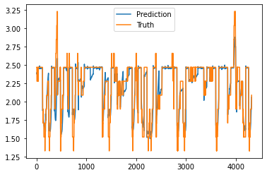

# THE NETWORK'S ARCHITECTURE

This Neural Network is implemented following the encoder-decoder architecture. The network is made of two 
distinct components: an "encoder" subnetwork, and a "decoder" subnetwork.

The encoder is a single LSTM layer, and its purpose is to compute a "state" vector, which represents the system's
(the refrigerating cell) current state, or context. The layer takes as input the whole set of selected features, in
a window that extends from the present moment up to 6 hours before, with a resolution of 1 minute.

The decoder has three hidden layers, a LSTM layer and two linear layers, and a final linear output layer. The decoder
should compute a vector of predictions for the refrigerating cell's inner temperature in the following hour, again with a 1 minute resolution. The subnetwork receives as input the "state" vector produced by the encoder, together with the temperatures of the refrigerating liquid in the following hour. 

The basic idea that motivates using this network architecture is that the cell's inner temperature in one hour from now
should depend on the cell's current state ( wether the cell's temperature has been rising, or it has been constant for a while, ecc... ), and on the future values of the refregerating liquid's temperature.

# EXPERIMENT 1

Features that were considered:
- TemperaturaCelle
- PompaGlicoleMarcia
- TemperaturaRitornoGlicole
- PercentualeAperturaValvolaMiscelatrice
- TemperaturaMandataGlicole

Neural Network Architecture:
- Encoder layers: 1 LSTM layer with 16 units
- Decode layers: 1 LSTM layers with 16 units, 2 linear layers with 16 units, one output layer

Hyperparameters:
- 0.7, 0.2, 0.1 train, validation, test split
- 6 hours lookback window, 1h forward predictions
- 10 epochs
- Adam optimizer
- 72 items per batch

Results:
- loss: 0.0373 == mae: 0.0373 

